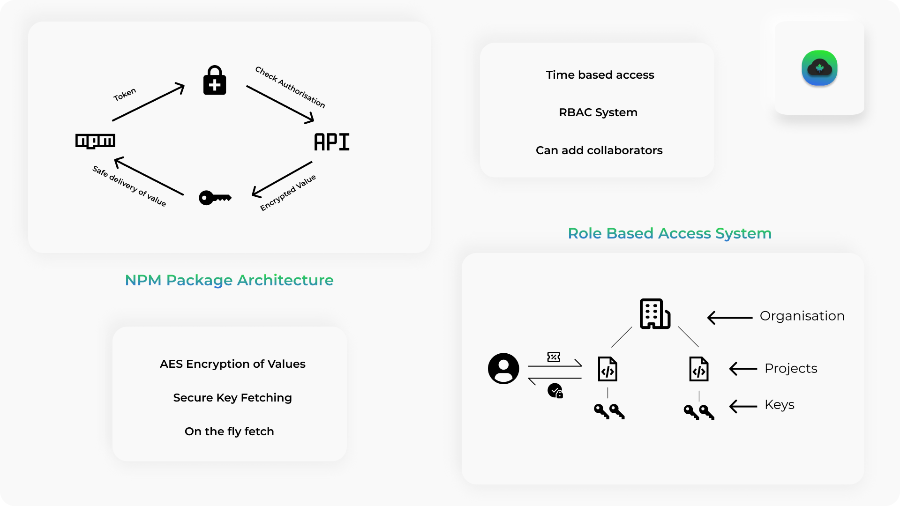

# DotCloud


> __DotCloud is a simple cloud hosted .env management solution that would help you reduce the risk of manually handling sensitive keys.__

## The Reason

- Have you faced issues in managing your .env variables?
- Are you risking exposing sensitive keys to other contributors or interns at your organisation?
- Do you need to temporarily provide access to certain key to someone?
- Do you need a solution where you don't need to migrate your .env variables as you jump across hosting?
- Would you like a place where you can manage all your .env varibles of all projects in one place?

DotCloud is a simple solution to all the aforementioned problems.

## Usage

Make sure you create a account in DotCloud API. This can be achieved via:

- Setting up DotCloud API on your own custom server, source code can be found [here](https://github.com/ShubhamPalriwala/DotCloud-API)
- Running our Postman Collection and creating your project, refer [here](#dotcloud-api)

If you have your .env in the following way

```env
myKey=12345
myKey1=54321
```

> Obtain your project token from DotCloud API after creating a project.

### To get a single key

```js
const dotCloud = require("dotcloud").init(
  "8880c820-af4b-4554-83c4-4ed4e97e0436", // Token
  "projectName" // Your Project Name
);

async function getKey() {
  const data = await dotCloud.fetchKey("myKey");
  return data;
}

getMyKey(); // Return the value of the key, i.e: 12345

```

### To fetch all the keys of the project

```js
const dotCloud = require("dotcloud").init(
  "8880c820-af4b-4554-83c4-4ed4e97e0436", // Token
  "projectName" // Your Project Name
);

async function getKeys() {
  const data = await dotCloud.fetchAllKeys();
  return data;
}

const keys = getKeys();

console.log(keys.myKey) // Prints 12345 
console.log(keys.myKey2) // Prints 543210
```

### Custom DotCloud Domain

If you have set-up DotCloud on your own servers, you can pass the url like the following.

```js
const dotCloud = require("dotcloud").init(
  "8880c820-af4b-4554-83c4-4ed4e97e0436", // Token
  "projectName" // Your Project Name,
  "https://dotcloud.benro.tech" // Custom DotCloud API Server setup. (Optional)
);
```

## DotCloud API

To use this package, make sure you create an account with out DotCloud API, which can be found [here](https://documenter.getpostman.com/view/11026000/TW6tNAhC).

The source code for the API can be found [here on GitHub](https://github.com/ShubhamPalriwala/DotCloud-API)

You can also directly run our API Collection in Postman.

[](https://god.gw.postman.com/run-collection/3ab4377ff5f19cd3f345#?env%5BAzure%5D=W3sia2V5IjoidXJsIiwidmFsdWUiOiJodHRwczovL2RvdGNsb3VkLmF6dXJld2Vic2l0ZXMubmV0IiwiZW5hYmxlZCI6dHJ1ZX1d)

## Working Principles



## Show your support

Give a ⭐ if this project made your life easy!

Spread the word to your Backend Developer fellows to make thier life easier too!

## Contributions

- Feel Free to Open a PR/Issue for any feature or bug(s).
- Make sure you follow the community guidelines!
- Feel free to open an issue to ask a question/discuss anything about DotCloud.
- Have a feature request? Open an Issue!

## License

Copyright 2021 Hemanth Krishna

Licensed under MIT License : <https://opensource.org/licenses/MIT>
